###JDK多版本安装并配置环境变量

* [安装jdk8](#1)

* [同时安装jdk10](#2)

>在安装Java之前，我想大家需要先理解两个重要的概念**jdk**和**jre**。

>jre是java运行时环境(Java Runtime Environment),一些用java开发的程序或者依赖java的程序在使用时，需要安装jre，里面包含了一个java虚拟机jvm。

>jdk是java开发工具包(java development kit),是提供给Java开发者使用的，里面包含了一些基本的和常用的类库，安装好Jdk并配置成功环境变量之后，就可以使用这些类库了。

下面我们就开始安装jdk1.8版本吧！

#####下载
>我们到[orcal官网](http://www.oracle.com/technetwork/java/javase/downloads/jdk8-downloads-2133151.html)找到1.8版本的jdk，接受协议并下载windows64位。

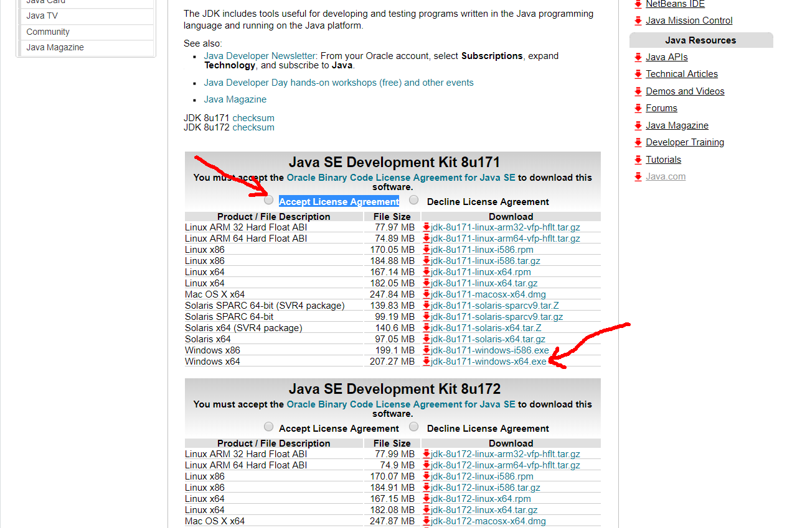

#####安装
>下载完场之后直接双击打开，点击下一步

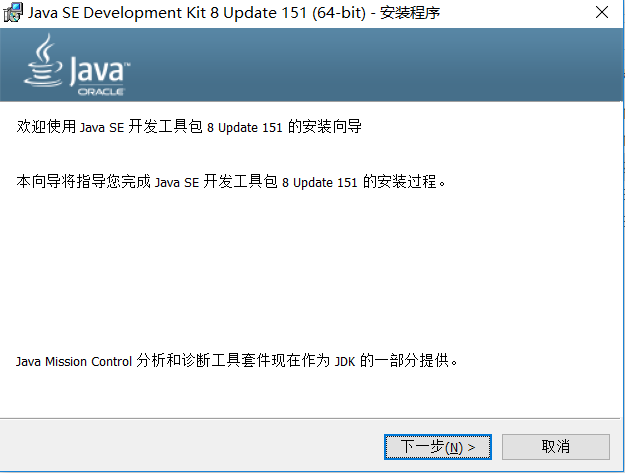

>下面可以选择安装路径，建议使用此默认路径安装在C盘

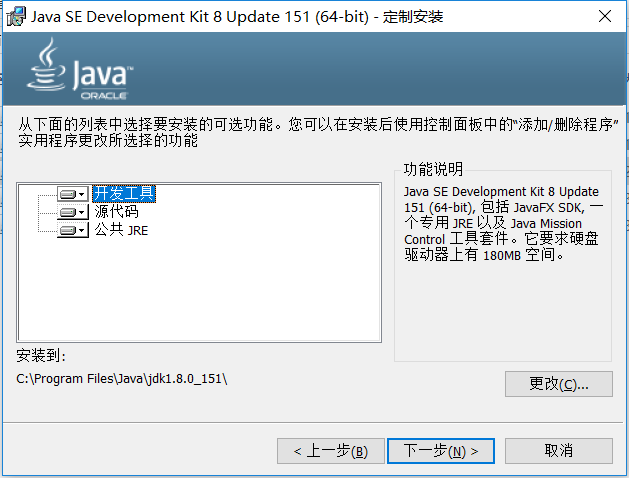

>提取安装程序中，快结束时，会弹出安装jre，建议使用默认路径，直接下一步。

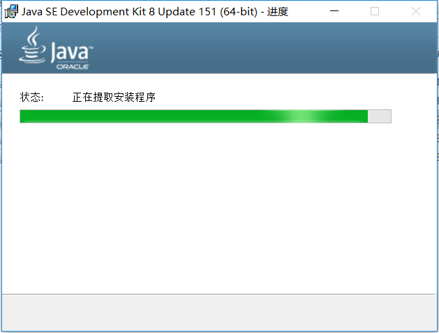
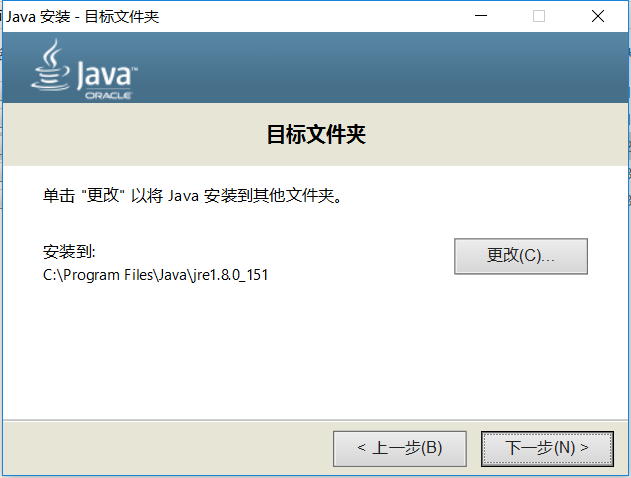
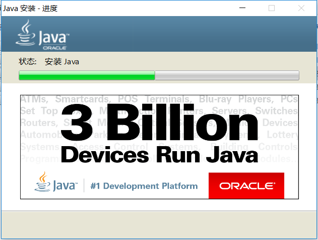
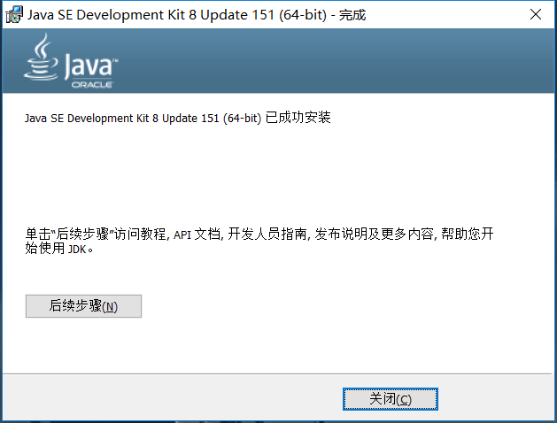

>到这里，java即jre安装成功,jre已经默认配置好了环境变量,打开cmd输入 **java -version**,可以看到java版本说明安装成功。

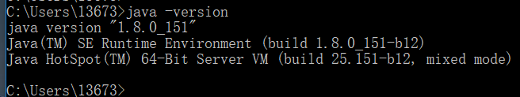

#####jdk环境变量配置
我们已经安装好了jre，但是作为开发者还需要jdk,jdk安装成功并没有配置环境变量

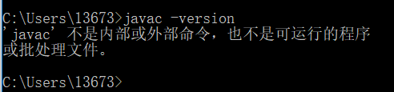

>鼠标右键此电脑(win10)-->属性-->高级系统设置-->环境变量-->新建。

变量名:**JAVA_HOME**，变量值:**jdk路径**
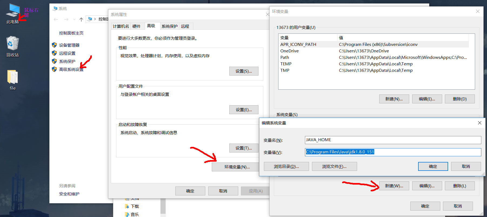

>找到**Path**环境变量-->编辑-->新建-->**%JAVA_HOME%\bin\\**

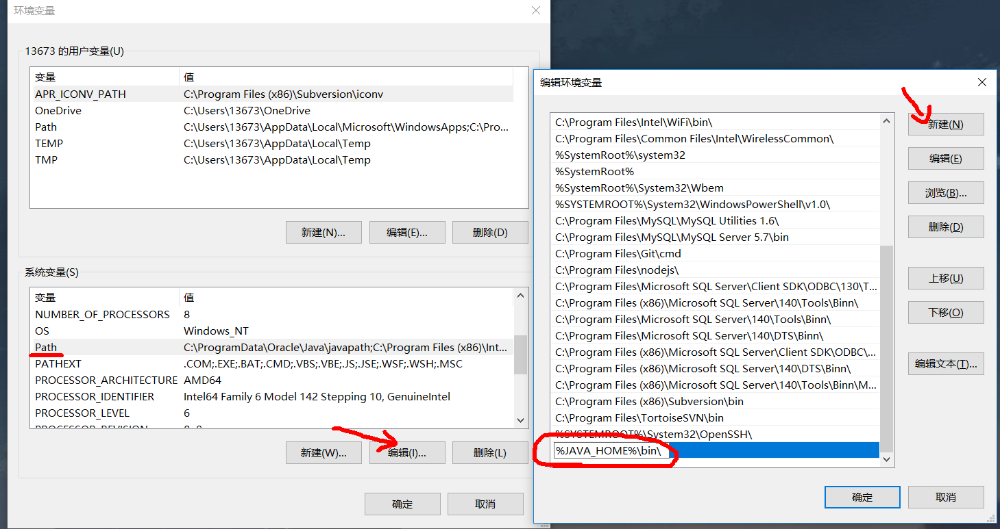

>打开cmd输入**javac -version**
看到版本号说明jdk环境变量安装成功(自1.6之后不需要配 **classpath** 环境变量)。

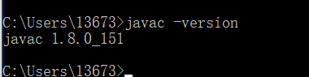

####安装jdk10 与8并存

>同样去官网下载jdk10，然后安装(与上面步骤一样)
安装完10之后我们会发现与8有些不同，jdk10目录下不包含jre，需要我们使用自定义安装的jre。

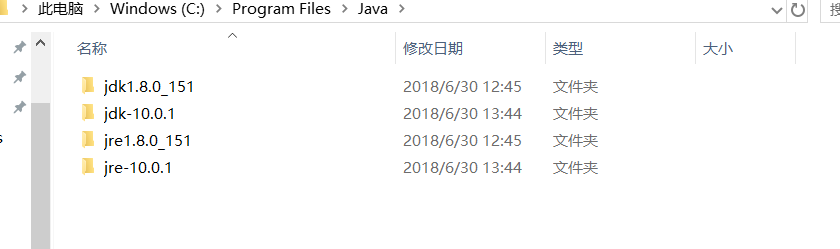

**jdk8有jre**

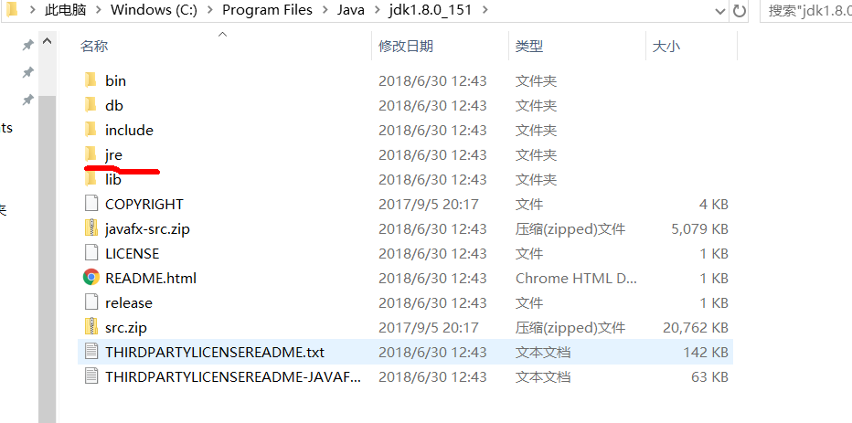

**jdk10没有jre，需要使用外面的jre10**

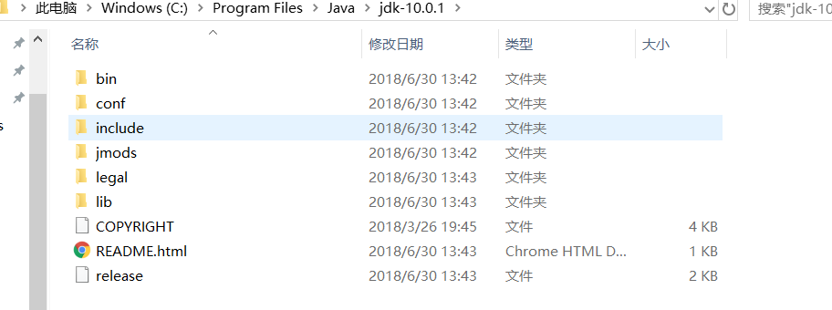

>然后我们新建和修改环境变量，最终如图所示

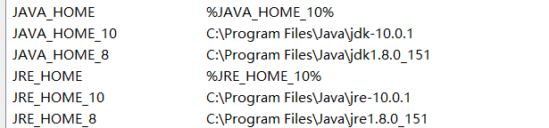

>修改path环境变量

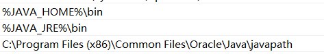

>我们重新打开cmd(每次修改环境变量都要重新打开)，分别输入**java -version** 和 javac -version,可是会出现两个版本不一致的问题。

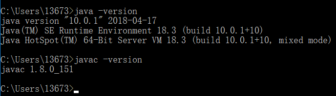

>这是因为环境变量优先级的问题导致的，我们在安装jdk8时，系统会在**C:\Windows\System32**目录下新建java环境程序，我们要删除 **java.exe、javaw.exe、javaws.exe**三个可执行文件。

>删除之后重新打开依然不一致，这是因为安装jdk10时，又有了新的环境路径

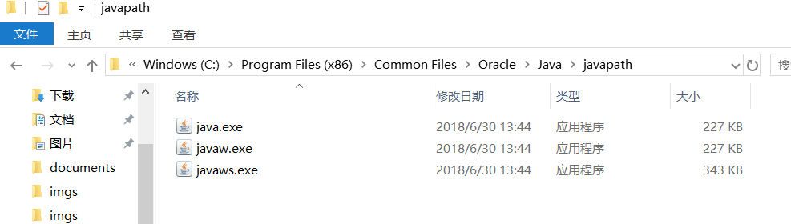

>并且在Path环境变量中可以看到它，他本来是在最上边的，将它移动到**JAVA_HOME**和**JRE_HOME**后面即可(删除也行)。

至此，修改JAVA_HOME和JRE_HOME就可随意切换java版本了。

---
<--完-->

