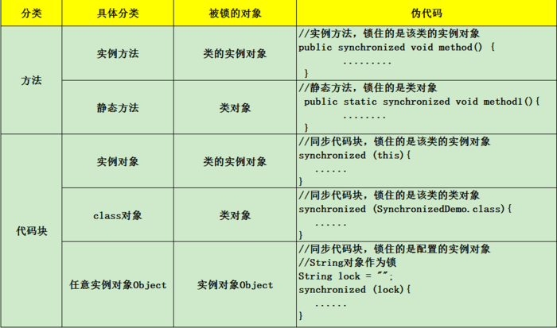

## Java线程通信--共享变量

---

### 一、什么情况下需要多线程？

使用多线程的目的一定是为了提高工作效率，比如我们需要完成一件事A，这件事需要完成B和C两个部分，但是B和C又互不影响没有什么关联，那我们就可以将B和C分别用两个线程来处理。

### 二、线程安全与不安全

涉及到线程时，我们通常会说线程安全、线程不安全。那么什么是线程安全什么是不安全呢？</br>

线程安全就是说，异步完成的操作和同步完成时结果是一致的。比如我先做B再做C和开两个线程同时做B、C结果一致，就是线程安全的，反之就是不安全。</br>

产生线程不安全的原因就是因为共享变量的读写问题。</br>
比如有共享变量COUNT=0,我B线程读到了共享变量COUNT，要进行+1操作，C线程也读取进行+1，两个操作结束后COUNT应该+2,但是B线程+1后还没来得及写进内存，C线程读取了COUNT(值为0),C线程进行+1后再写进内存，最后COUNT的值还是1而不是期望的值2。**这种情况就被称之为脏读**
。
#### 2.1 脏读模拟

下面我们通过一段代码来模拟一下脏读的概念。

>新建共享数据类ShareData

```
public class ShareData {
    public static int count = 2;
}
```

>新建线程类ThreadA

```
public class ThreadA implements Runnable {

    /*A对ShareData.count -1 */

    private int count;

    @Override
    public void run() {
        this.count = ShareData.count;
        System.out.println("thread-a:开始执行，读取count:" + this.count);

        System.out.println("thread-a:ShareData.count加1");
        this.count --;
        System.out.println("thread-a:cout减1了，写进内存");

        /*sleep3s，模拟没来得及写入内存中*/
        try {
            Thread.sleep(3000);
        } catch (InterruptedException e) {
            e.printStackTrace();
        }
        ShareData.count = this.count;

        System.out.println("thread-a:执行结束，count:" + this.count);

    }

}
```

>新建线程类ThreadB

```
public class ThreadB implements Runnable {
    /*ThreadB，也进行减1操作*/

    private int count;
    @Override
    public void run() {
        this.count = ShareData.count;
        System.out.println("thread-b:开始，count=" + this.count);
        this.count --;
        ShareData.count = this.count;
        System.out.println("thread-b:结束，count=" + this.count);

    }
}
```

>运行两个线程

```
public class App {

    public static void main(String[] args) {
        System.out.println("main-开始:ShareData.count:" + ShareData.count);

        Thread threadA = new Thread(new ThreadA());
        threadA.start();
        System.out.println("main-thread:线程A开启");

        Thread threadB = new Thread(new ThreadB());
        threadB.start();
        System.out.println("main-thread:线程B开启");

        try {
            threadA.join();
            System.out.println("main-thread:线程A加入主线程");

            threadB.join();
            System.out.println("main-thread:线程B加入主线程");
        } catch (InterruptedException e) {
            e.printStackTrace();
        }
        System.out.println("main-结束:最终ShareData.count:" + ShareData.count);
    }
}
```

>运行结果

```
main-开始:ShareData.count:2
main-thread:线程A开启
thread-a:开始执行，读取count:2
thread-a:ShareData.count-1
thread-a:cout减1了，写进内存
main-thread:线程B开启
thread-b:开始，count=2
thread-b:结束，count=1
thread-a:执行结束，count:1
main-thread:线程A加入主线程
main-thread:线程B加入主线程
main-结束:最终ShareData.count:1
```

我们可以看到两个线程都运行了，但是count是1不是0,因为我们延迟了ThreadA修改数据后写入ShareData.count的时间，导致ThreadB读取的还是旧的值0，ShareData.count++后就还是1写入。

### 三、synchronized关键字

#### 3.1 脏读

在上面的例子中，我们只是模拟了数据脏读的情况，并不是真正的因为共享变量而导致线程间数据不准确。我们看下面的例子。

>新建ThreadA类

```
public class ThreadA implements Runnable {

    /*开启此线程，ShareData.count增加1000*/

    @Override
    public void run() {
        for (int i = 0; i < 1000; i ++){
            ShareData.count1 ++;
        }
    }
}
```

>运行下面例子

```
public class App {

    public static void main(String[] args) {

        System.out.println(ShareData.count1);
        /*开启10个ThreadA线程共同计算*/
        for (int i = 0; i < 10; i++) {
            Thread thread = new Thread(new ThreadA());
            thread.start();
        }

        try {
            /*休息1s是为了等待10个线程都结束，其实休息时间为一个线程的运行时间即可*/
            Thread.sleep(5000);
        } catch (InterruptedException e) {
            e.printStackTrace();
        }
        System.out.println(ShareData.count1);
    }
}
```

>运行结果

```
0
9971
```

我们期望的结果是10000，但是总是小于等于10000而且每次结果都不一样。这是因为每个线程中读取数据是并没有一个先后顺序，比如线程1读取相加时是0，线程2读的时候也是0，都+1后其实一共只+1而不是+2.

#### 3.2 synchronized关键字

我们大概了解一下，synchronized关键字使用方法见下图。



如图，synchronized可以用在方法上也可以使用在代码块中，其中方法是实例方法和静态方法分别锁的是该类的实例对象和该类的对象。而使用在代码块中也可以分为三种，具体的可以看上面的表格。这里的需要注意的是：如果锁的是类对象的话，尽管new多个实例对象，但他们仍然是属于同一个类依然会被锁住，即线程之间保证同步关系。

下面我们使用synchronized关键字保持线程同步。

>新建SynchronizedThread类

```
public class SynchronizedThread implements Runnable {
    @Override
    public void run() {
        synchronized (SynchronizedThread.class){
            for (int i = 0; i < 1000; i++) {
                ShareData.count1++;
            }
        }

    }
}
```

>运行程序

```
public class App {

    public static void main(String[] args) {

        System.out.println(ShareData.count1);
        /*开启10个ThreadA线程共同计算*/
        for (int i = 0; i < 10; i++) {
            Thread thread = new Thread(new SynchronizedThread());
            thread.start();
        }

        try {
            /*休息5s是为了等待10个线程都结束，其实休息时间为一个线程的运行时间即可*/
            Thread.sleep(5000);
        } catch (InterruptedException e) {
            e.printStackTrace();
        }
        System.out.println(ShareData.count1);
    }
}
```

这样无论运行多少次，结果都是10000.

### 四 volatile关键字

我们经常使用的是synchronized关键字对代码块进行同步，其实volatile关键字也可以实现共享变量在线程之间的同步通信。我们先看下面一个例子。

#### 4.1

>ShareData增加变量 flag

```
public class ShareData {

    public static int count = 2;
    public static int count1 = 0;

    public static boolean flag = false;
}
```

>新建VolatileThread类

```
public class VolatileThread implements Runnable {
    @Override
    public void run() {
        System.out.println("volatile-thread:开始");
        while (!ShareData.flag) {
        }
        System.out.println("volatile-thread:结束");
    }
}
```

>运行程序

```
public class App {

    public static void main(String[] args) {
        System.out.println("main-thread开始:share-data-flag=" + ShareData.flag);

        Thread thread = new Thread(new VolatileThread());
        thread.start();
        System.out.println("main-thread:volatile-thread已经启动");

        try {
            Thread.sleep(5000);
            ShareData.flag = true;
            System.out.println("main-thread:5秒之后，我修改了flag:" + ShareData.flag);
        } catch (InterruptedException e) {
            e.printStackTrace();
        }

        System.out.println("main-thread结束:share-data-flag=" + ShareData.flag);
    }
}
```

>运行结果

```
main-thread开始:share-data-flag=false
main-thread:volatile-thread已经启动
volatile-thread:开始
main-thread:5秒之后，我修改了flag:true
main-thread结束:share-data-flag=true
```

我们可以看到程序进入了死循环，虽然主线程修改了ShareData.flag=true，但是线程volatile-thread并不知道共享变量已经改变，它的工作区副本里面还是旧值false,所以程序进入了死循环。

#### 4.2

我们只需要修改一下flag，增加volatile修饰

```
    public static volatile boolean flag = false;
```

>运行程序结果

```
main-thread开始:share-data-flag=false
main-thread:volatile-thread已经启动
volatile-thread:开始
main-thread:5秒之后，我修改了flag:true
main-thread结束:share-data-flag=true
volatile-thread:结束
```

我们在main线程中修改了flag字段，volatile-thread线程内存区flag的值就会失效，重新从主存中读取，当它读取为true时线程就会中断。

---

--完--