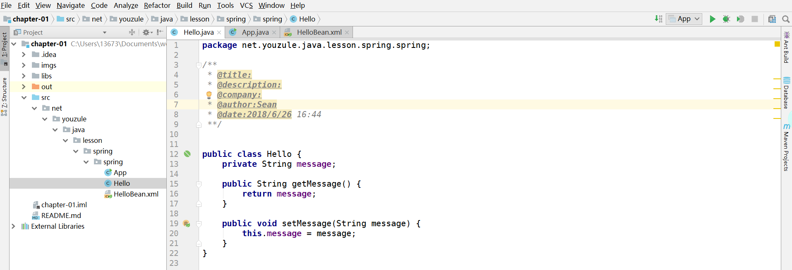

###初步使用spring
>说明:本系列的spring教程参考[w3cschool-spring教程](https://www.w3cschool.cn/wkspring/).<br/>
>spring版本使用 **4.1.6**, jdk使用 **1.8**, ide使用 **IDEA**.

####下载jar包
从[spring官网](http://repo.spring.io/release/org/springframework/spring/)根据版本下载相应版本的库.

从[apache](http://commons.apache.org/proper/commons-logging/)下载commons-loggingAPI

####项目搭建
使用idea新建一个java项目，再新建一个libs目录，将spring所有的jar包和common-logging jar包复制到libs目录中。

新建一个**Hello**类，里面有一个属性**message**。

```
public class Hello {
    private String message;

    public String getMessage() {
        return message;
    }

    public void setMessage(String message) {
        this.message = message;
    }
}
```

新建一个spring配置文件 **HelloBean.xml** ，可以放在与Hello类同级目录下面，并添加一些配置信息。

```
<?xml version="1.0" encoding="UTF-8"?>
<beans xmlns="http://www.springframework.org/schema/beans"
       xmlns:xsi="http://www.w3.org/2001/XMLSchema-instance"
       xsi:schemaLocation="http://www.springframework.org/schema/beans http://www.springframework.org/schema/beans/spring-beans.xsd">
    
    <bean id="hello" class="net.youzule.java.lesson.spring.spring.Hello">
        <property name="message" value="hello world"></property>
    </bean>
    
</beans>
```

创建 **App** 类，运行程序

```
public class App {

    public static void main(String[] args) {
        ApplicationContext applicationContext = new ClassPathXmlApplicationContext("classpath:net/youzule/java/lesson/spring/spring/HelloBean.xml");
        Hello hello = (Hello) applicationContext.getBean("hello");
        System.out.println(hello.getMessage());

    }
}
```

如果控制台中成功打印 **hello world** 说明运行成功。
完整的demo结构图如下所示。


---
--完--